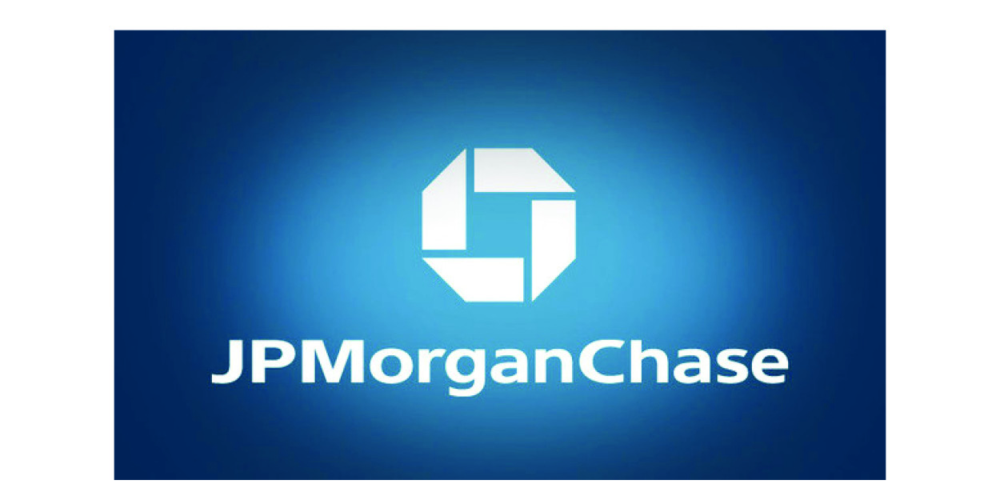
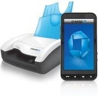
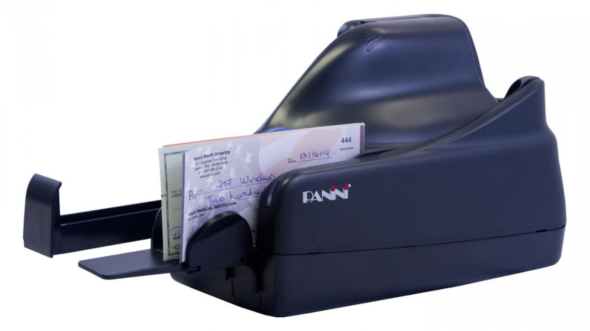

# FinTech-Case-Study

## Overview and Origin

JPMorgan Chase & Co. is a leading global financial services company, and one of the largest banking institutions in the United States. The company has operations worldwide and is a leader in investment banking, financial services for consumers and small businesses, commercial banking, financial transaction processing and asset management. With more than $2.6 trillion in assets, JPMorgan is one of the 10 largest banks worldwide. JPMorgan stock has a market value of approximitely 210 billion dollars. 

---

## Business Activities:

Under the J.P. Morgan and Chase brands, the company serves millions of customers in the United States, businesses across multiple channels, and many of the world’s most prominent corporate, institutional and government clients. JPMorgan Chase’s activities are organized, for management reporting purposes, into a Corporate segment and four major reportable business segments, which they refer to as the lines of business. 

The Consumer and Community Banking segment serves consumers and businesses through personal service at bank branches and through automated teller machine, online, mobile, and telephone Merchant Services and Auto ('Card'). Consumer and Business banking offers deposit and investment products and services to consumers, as well as lending, deposit, cash management and payment solutions to small businesses. 

>Their motto is to help their customers make the most of their money so they can make the most of their life. They focus on their customers ‘success. 

### Area of Technology:  Remote Check Deposit

#### Background

The events of September 11, 2001 revealed how much the check processing system relied on air travel.  Each original paper check had to be processed by the Fed and returned to the account holder’s bank but 9/11 temporarily grounded airplanes, creating a national backlog and emergency. 

To prevent future disruptions The Check Clearing for the 21st Century Act (Check 21) is a federal law that took effect on October 28, 2004, and gives banks and other organizations the ability to create electronic image copies of consumers' checks, in a process known as check truncation. Check 21 allows banks to accept check images in lieu of paper checks.

Around 2009-10, many banks and other RDC providers began experimenting with lower-cost and pay-as-you go remote deposit services, and began supporting off-the-shelf equipment such as flatbed scanners and all-in-one printers. This brought remote deposit within reach of ever-smaller businesses and some individuals. In 2010 RDC mobile apps have begun using smartphone cameras to capture check images, bypassing PCs and scanners entirely. These apps are generally free or charge a low per-item fee, and therefore appeal to individual customers. However, the manual process and stricter limits on deposits can make them unwieldy for business use.

#### Chase Mobile Deposit and Quick Deposit Scanner

Remote deposit capture lets banking customers use their computers, tablets or smartphones to conveniently deposit checks. The process eliminates trips to the bank, and checks can be deposited 24/7, not just during regular banking hours. Individuals customers might use remote deposit capture for their paychecks, gift checks, refund checks and any other checks they receive. Businesses might use the technology to deposit checks they receive from their customers. Chase uses Mitek Systems the leader in mobile-imaging applications using smart phone cameras for check deposits and bill payments. They use specialized OCR sofware for highly accurate MICR validation and API for easy integration into mobile banking apps as well as core systems. Mitek Systems technology utilizes patented algorithms that analyze images of identity documents in many ways. These include image quality analysis, image repair and optimization, document identification and classification, data extraction, and authenticators.

 Chase Quick Deposit is ideal for companies that: 
 * Receive checks at their offices and make frequent trips to a local Chase branch.
 * Access check images for customer service purposes.
 * Spend time and effort managing multiple bank deposits.
 
 Chase QuickDeposit helps streamline customer deposits and gain access to their funds. It’s convenient, saves time and money. You can use Chase Quick Deposit to scan and deposit checks from the convenience of your office. Check images are transmitted electronically to Chase for deposit, and those received before 7:00PM Eastern Time on a business day are processed the same day. Chase Quick Deposit also gives you access to view check images and up to 120 days of account history. By targeting business clients, Chase offers single feed check scanner and multiple check scanner.

 
*  **Single Feed Scanner**: The machine allows 10 checks per deposit or less.

* **Mutliple Feed Check Scanner**: The machine allows 50 check deposits at a time.

## Landscape

In the banking industry, one the main causes that drive competition is the low switching costs that clients have. It became less expensive for them switch between products and companies. Chase traditional competitors are Bank of America, Citi Bank, Wells Fargo, HSBC and others. Chase has been investing a lot of money in technology to drive change and make banking convenient. They are advancing to the forefront of the industry by offering Chase Quick Deposit through Chase Commercial OnlineSM, one of the first fully integrated online check deposit and banking solutions. Some core metrics used to measure success are deposit limits, recommended paper check hold times, efficiency of use, consistency and standards, errors and prevention, auto capture function and real time deposit status updates. In 2020 Chase was ranked first out of 20 banks. 

## Recommendations

Chase is already ahead in the industry and is constantly improving. They need to keep the momentum. Therefore they sould consider few other solutions. They should allow foreign currency checks to be processed through Chase Quick Deposit, improve the preventing and spotting errors that slow down or impede the user experience, increase payment options and better customer experience, and enhance text recognition to improve error identification. Lastly, Chase is here to stay and become better everyday. They must continuously develop their encryption system to prevent growing fraud issues. 

---
**Reference:**

https://www.google.com/amp/s/nypost.com/2016/07/12/this-guy-just-saved-big-banks-on-wall-street-620m/amp/

https://www.prnewswire.com/news-releases/mitek-systems-signs-agreement-with-chase-for-mobile-deposit-reports-fiscal-2011-1st-quarter-earnings-116182564.html

https://www.digitalcheck.com/what-is-check21/

https://www.investopedia.com/terms/c/check_21.as

https://www.investopedia.com/remote-deposit-capture-definition-4684027

https://www.chase.com/business/online-banking/quick-deposit

https://www.jpmorganchase.com/

https://www.chase.com/

https://www.forbes.com/companies/jpmorgan-chase/#75752d1d9fa9

https://www.miteksystems.com/files/docs/2017mobiledepositbenchmark-report092517pdf.pdf

https://www.digitaltransactions.net/despite-increasing-adoption-theres-room-for-improvement-in-mobile-deposits-study-finds/

http://investors.miteksystems.com/static-files/7727cdc7-556c-409e-82bf-89c78c658f32

